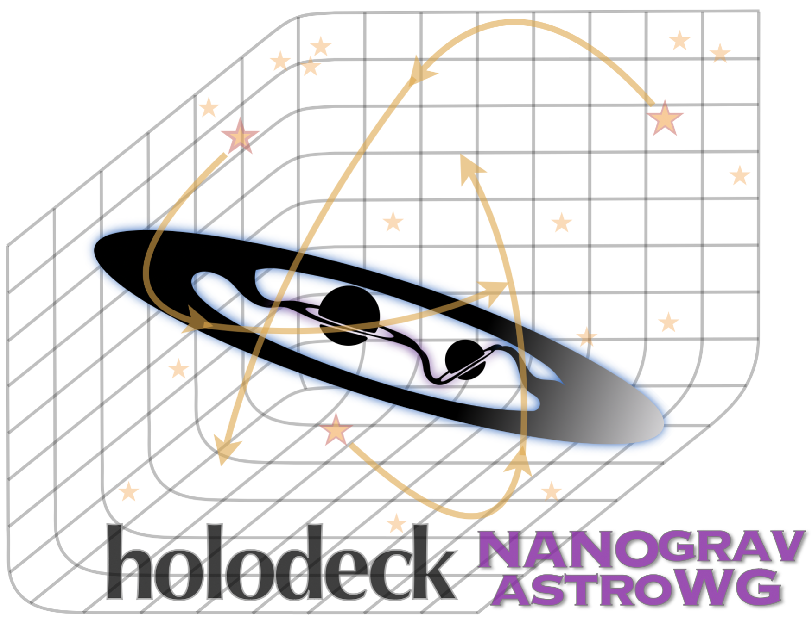

# holodeck

[//]: # (Badges)
[](https://github.com/nanograv/holodeck/actions/workflows/unit-tests-ci.yaml)
[](https://codecov.io/gh/nanograv/holodeck)
[](https://readthedocs.org/projects/holodeck-gw/)

*Massive Black-Hole Binary Population Synthesis for Gravitational Wave Calculations ≋●≋●≋*



This package provides a comprehensive framework for MBH binary population synthesis.  The framework includes modules to perform population synthesis using a variety of methodologies from semi-analytic models, to cosmological hydrodynamic simulations, and even observationally-derived galaxy merger catalogs.

## Getting Started

(1) Read the [getting started guide](https://holodeck-gw.readthedocs.io/en/main/getting_started/index.html).  
(2) Install `holodeck` following the [Installation](#installation) instructions below.
(3) Explore the [package demonstration notebooks](https://github.com/nanograv/holodeck/tree/main/notebooks).


## Installation

The `holodeck` framework is currently under substantial, active development.  Stable versions are now available with `pip install holodeck-gw` (see [holodeck on pypi](https://pypi.org/project/holodeck-gw)).  However, recent versions and many development tools will not generally be available with ``pip`` or ``conda`` install.

`holodeck` requires ``python >= 3.9`` (with support for: ``3.9, 3.10, 3.11``).  The recommended installation is:

(0) OPTIONAL & recommended: create and activate a new **anaconda** environment to isolate your build:

   ```bash
   conda create --name holo311 python=3.11; conda activate holo311
   ```

   Note that you will need to activate this environment every time you want to use holodeck.  If you're not familiar with **anaconda**, take a look at their official [Getting started guide](https://conda.io/projects/conda/en/latest/user-guide/getting-started.html#managing-python).  To use your anaconda environment with jupyter notebooks, make sure to add this environment to your ipython kernels:

   ```bash
   conda install -c conda-forge ipykernel
   python -m ipykernel install --user --name=holo311
   ```

(1) Clone the `holodeck` repository, and move into the repo directory:

   ```bash
   git clone https://github.com/nanograv/holodeck.git; cd holodeck
   ```

(2) Install the required external packages specified in the requirements file:

   ```bash
   pip install -r requirements.txt
   ```

   OPTIONAL: install development requirements::

   ```bash
   pip install -r requirements-dev.txt
   ```

(3) Build the required c libraries from `holodeck` `cython` code:

   ```bash
   python setup.py build_ext -i
   ```

(4) Perform a development/editable local installation:

   ```bash
   python setup.py develop
   ```

The 'editable' installation allows the code base to be modified, and have those changes take effect when using the `holodeck` module without having to rebuild/reinstall it.  Note that any changes to the `cython` library files do still require a rebuild by running steps (3) and (4) above.

### MPI

For some scripts (particularly for generating libraries), an MPI implementation is required (e.g. `openmpi`), along with the [mpi4py package](https://github.com/mpi4py/mpi4py).  This is not included as a requirement in the `requirements.txt` file as it significantly increases the installation complexity, and is not needed for many `holodeck` use cases.  If you already have an MPI implementation installed on your system, you should be able to install `mpi4py` with anaconda: `conda install mpi4py`.  To see if you have `mpi4py` installed, run `python -c 'import mpi4py; print(mpi4py.__version__)'` from a terminal.

**macos users**: if you are using homebrew on macos, you should be able to simply run: `brew install mpi4py` which will [include the required openmpi implementation](https://mpi4py.readthedocs.io/en/latest/install.html#macos).


## Quickstart

(1) Read the [Getting Started Guide](https://holodeck-gw.readthedocs.io/en/main/getting_started/index.html).  
(2) Explore the [package demonstration notebooks in `holodeck/notebooks`](https://github.com/nanograv/holodeck/tree/main/notebooks).


## Documentation

Full package documentation for `holodeck` is available on [readthedocs](https://holodeck-gw.readthedocs.io/en/main/).


## Contributing & Development

Contributions are not only welcome but encouraged, anywhere from new modules/customizations to bug-fixes to improved documentation and usage examples.  Please see [Development & Contributions](https://holodeck-gw.readthedocs.io/en/main/development.html).

## Copyright

Copyright (c) 2024, NANOGrav

The `holodeck` package uses an [MIT license](./LICENSE).


## Attribution & Referencing

A dedicated paper on ``holodeck`` is currently in preparation, but the package is also described in the recent [astrophysics analysis from the NANOGrav 15yr dataset](https://ui.adsabs.harvard.edu/abs/2023ApJ...952L..37A/abstract).


   ```tex
   @ARTICLE{2023ApJ...952L..37A,
         author = {{Agazie}, Gabriella and {et al} and {Nanograv Collaboration}},
         title = "{The NANOGrav 15 yr Data Set: Constraints on Supermassive Black Hole Binaries from the Gravitational-wave Background}",
         journal = {\apjl},
            year = 2023,
         month = aug,
         volume = {952},
         number = {2},
            eid = {L37},
         pages = {L37},
            doi = {10.3847/2041-8213/ace18b},
   archivePrefix = {arXiv},
         eprint = {2306.16220},
   primaryClass = {astro-ph.HE},
         adsurl = {https://ui.adsabs.harvard.edu/abs/2023ApJ...952L..37A},
   }
   ```
